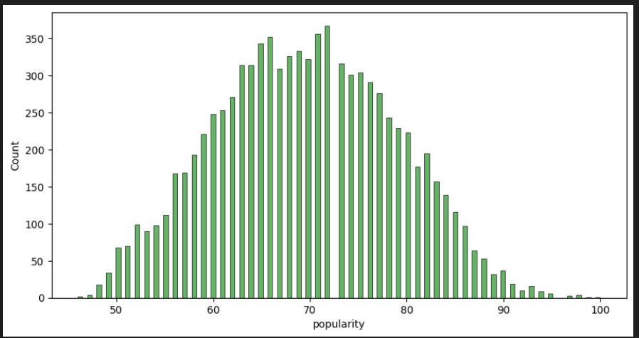
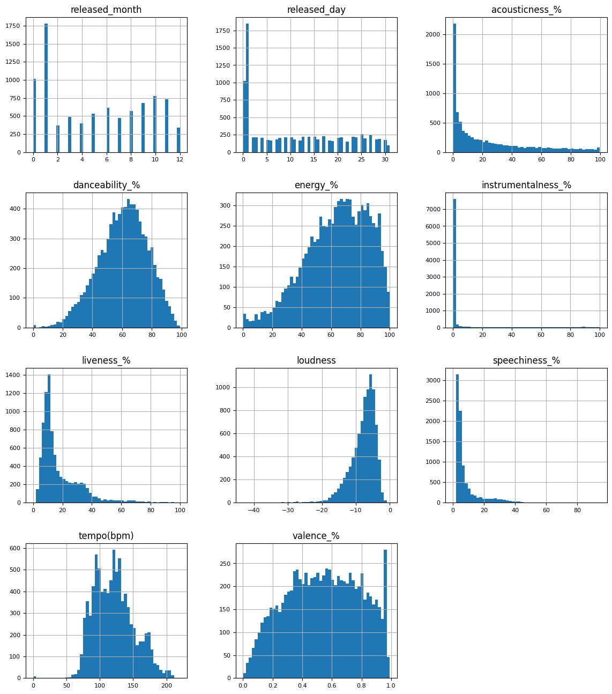
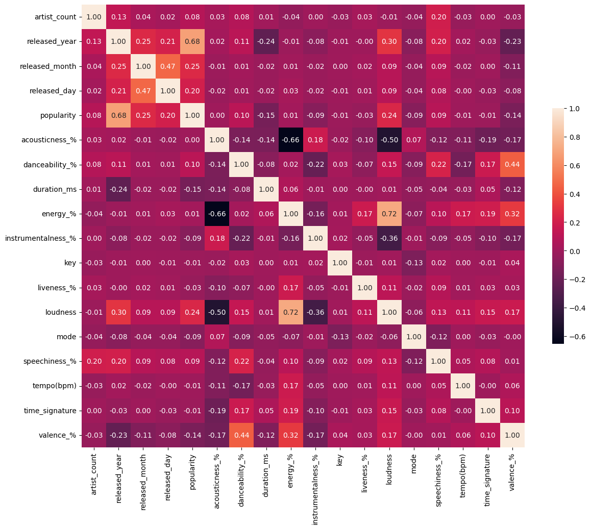

# Analysis Result
We have done the following analysis.
## Popularity (Traget)
The definition of popularity is defined by soptify. The detail description of popularity is in [here](https://developer.spotify.com/documentation/web-api/reference/get-track?fbclid=IwAR0vgs_ljSiNOyAakJAExroAvtbKjIFZbzhlm0XUqmX84e0NEBdVet-FTvE).

We can see that the output is normal distribution.
## Feature Distribution
We visualize the distribution of feature.

## Correlationship between feature
We use pearson method to calculate the correlation.

##Conclusion 
The current observation indicates that there is no clear linear relationship among features, except for a noticeable correlation between the release year and popularity.
