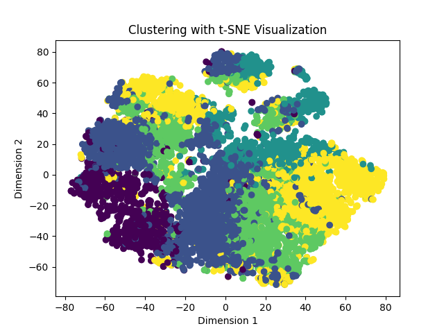
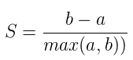

# Model
In here we are going to introduce our model.
## Data Process
* 我們只保留numerical的資料
* Fill up mean value into Nan entry
## Classification 
------
### Setting
* Input: Comes from csv files
* Output:  Popularity or stream_value
    * We formulate our output with the following format:
        * Vector (with n bins. Each bins corresponding with a certain interval) -> (5)
        [46-61,61-67,67-72,72-78,78-100] -> 每個class 大概有1754個
### Method
The following are the methods that we have try:
* RandomForest:

* DNN (Deep Neural Network):

### Metric
We use F1-macro to evaluate the performance of our model.

## Cluster
---
### Goals
Idealy, we want to categorize similar music into one set. We can find some metric to quantify each model's performance.
### Setting
* Input: Vector comes from data process
* Output: N x cluster set
### Method
I use the following method to cluster the labels.
* KMeans
    
### Metric
We try use the following metric to quantify each model's performance.
* Silhouette coefficient:
    
    * b means the average distance between cluster.
    * a means the average distance in the same cluster
### Visuzlization Result
To visualize the final result, I use TSNE to reduce the dimension. I use some tool to visualize the result in 3D ways.
### Conclusion
我利用一些metric去看各個演算法fit的情況如何。